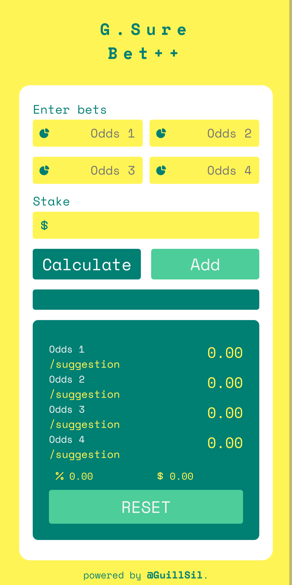

# Calculadora Surbet

Este proyecto es una calculadora surbet desarrollada por  guillsil(Guillermo Silva) es una herramienta utilizada en las apuestas deportivas para calcular las ganancias potenciales de una combinación de apuestas.

En este caso, la calculadora Surbet desarrollada por mi, permite realizar cálculos para hasta 3 apuestas aparte de las dos principales. Esto significa que puedes ingresar hasta 3 apuestas adicionales junto con las dos apuestas principales y la calculadora te mostrará las ganancias potenciales en caso de que todas las apuestas sean exitosas.

En resumen, esta calculadora Surbet es una herramienta útil para los apostadores deportivos que desean calcular sus ganancias potenciales al realizar combinaciones de apuestas.

## Capturas de pantalla

## Uso

1. Abre tu navegador y visita `https://calculadora-surbets.netlify.app/`

2. Ingresa las cuotas de las dos apuestas principales y hasta 3 apuestas adicionales.
3. Haz clic en el botón "Calcular" para obtener las ganancias potenciales.
4. Se mostrará el resultado de las ganancias potenciales en la parte inferior de la calculadora.

## Herramientas Utilizadas
- HTML
- CSS- SASS
- JavaScript
- Netlify

